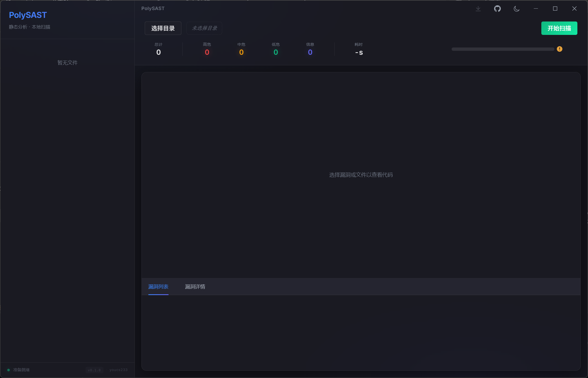

# PolySAST

### 🔒 Next-Generation Static Application Security Testing

**极速 · 精准 · 本地优先**

 

*基于 AST 语法树分析的下一代代码审计工具*

---

## ✨ Introduction

**PolySAST** 是一款高性能的本地化静态应用程序安全测试 (SAST) 工具，专为安全研究员和开发团队打造。

与传统云端扫描工具不同，PolySAST 采用 **Local-First (本地优先)** 架构——您的源代码永远不会离开本地设备，从根本上杜绝代码泄露风险。

> 🛡️ **您的代码，从不上传。扫描引擎，触手可及。**

---

## 🚀 Key Features

<table>
<tr>
<td width="50%">

### ⚡ 并行极速扫描

利用 Rust 多核并行计算能力，在数秒内完成数千文件的安全扫描。告别漫长等待，让安全审计融入开发流程。

</td>
<td width="50%">

### 🎯 精准 AST 引擎

基于 Tree-sitter 的语法树分析，比正则匹配更智能。精确识别代码上下文，大幅降低误报率。

</td>
</tr>
<tr>
<td>

### 🎨 沉浸式审计体验

Dark Glassmorphism 设计语言，漏洞列表与代码查看器实时联动。点击漏洞，一键定位问题代码行。

</td>
<td>

### 📊 专业报告导出

支持 HTML 可视化报告和 CSV 数据导出，满足合规审计与团队协作需求。

</td>
</tr>
</table>

---

## 🏗️ Technology Stack

PolySAST 采用现代化技术架构，兼顾性能、安全与用户体验：

| 层级 | 技术选型 | 优势 |
|------|---------|------|
| **桌面框架** | Tauri 2 | 比 Electron 更轻量，原生级安全沙箱 |
| **后端引擎** | Rust | 内存安全，零成本抽象，极致性能 |
| **前端界面** | Vue 3 + Element Plus | 响应式 UI，组件化设计 |
| **语法分析** | Tree-sitter | 增量解析，多语言支持，毫秒级响应 |
| **并行计算** | Rayon | 自动负载均衡，充分利用多核 CPU |

---

## ⚡ Performance

得益于 Rust + Rayon 的并行架构，PolySAST 能够充分利用现代多核处理器：

| 项目规模 | 文件数量 | 扫描耗时 (8核 CPU) |
|---------|---------|-------------------|
| 小型项目 | ~100 | < 1s |
| 中型项目 | ~1,000 | ~3s |
| 大型项目 | ~5,000 | ~15s |

> 📈 实测加速比约为 **CPU 核心数 × 0.6~0.8**，接近线性扩展。

---

## 📖 Usage

### 快速开始

1. **选择项目目录**
   
   点击「选择项目」按钮，或将文件夹拖入窗口。

2. **启动扫描**
   
   点击「开始扫描」，引擎将自动识别语言并执行安全检测。

3. **审计漏洞**
   
   在漏洞面板中浏览发现的问题，点击任意条目即可跳转至对应代码行。

4. **导出报告**
   
   点击导出按钮，选择 HTML 或 CSV 格式保存审计报告。

---

## 📥 Installation

### Windows

下载最新版本安装包：

- **[polysast_x64-setup.exe](https://github.com/youcs233/PolySAST/releases/latest)** (NSIS 安装程序)
- **[polysast_x64.msi](https://github.com/youcs233/PolySAST/releases/latest)** (MSI 安装包)

### macOS

> 🚧 macOS 版本即将推出，敬请期待。

---

## 🔐 Security

- **本地优先**: 所有扫描在本地完成，代码未来开源
- **规则加密**: 检测规则经过加密存储，防止逆向分析
- **沙箱隔离**: 基于 Tauri 原生安全模型，进程隔离运行

---

## 📜 License

**Copyright 2024-2025 youcs233. All Rights Reserved.**

本软件为专有软件 (Proprietary Software)。未经授权，禁止：

- 反编译、逆向工程或尝试提取源代码
- 复制、修改或创建衍生作品
- 再分发、转售或商业许可给第三方

如需商业授权或企业定制，请联系作者。

---

**PolySAST** — *Secure Code, Locally.*

Made with ❤️ by [youcs233](https://github.com/youcs233)

