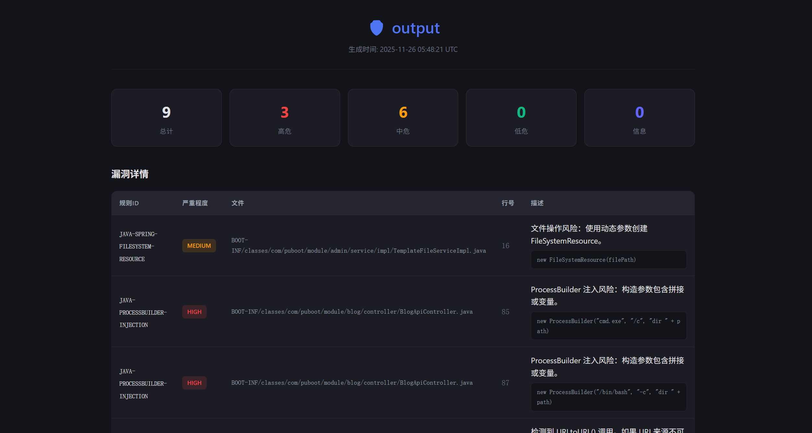
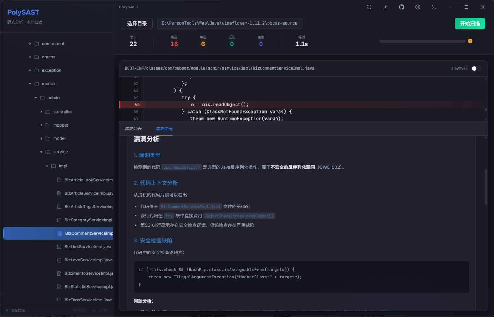
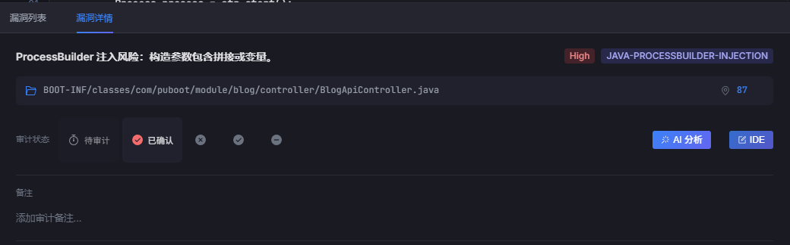

# PolySAST

### 🔒 Next-Generation Static Application Security Testing

**极速 · 精准 · 智能 · 本地优先**

 

*AST 语法分析 × AI 智能验证 — 重新定义代码审计体验*

---

## ✨ Introduction

**PolySAST** 是一款融合 AI 智能分析的高性能静态应用程序安全测试 (SAST) 工具，专为安全研究员和开发团队打造。

与传统云端扫描工具不同，PolySAST 采用 **Local-First (本地优先)** 架构——您的源代码永远不会离开本地设备，AI 分析由用户主动触发，从根本上杜绝代码泄露风险。

> 🛡️ **您的代码，从不上传。智能引擎，触手可及。**

---

## 🚀 Key Features

<table>
<tr>
<td width="50%">

### ⚡ 极速扫描引擎

基于 Rust + Rayon 并行计算与 Tree-sitter 语法树分析，数秒内完成数千文件扫描。比正则更智能，精准识别代码上下文，大幅降低误报率。

</td>
<td width="50%">

### ✨ AI 智能验证 Beta

集成 LLM 大模型（支持 OpenAI / DeepSeek），自动提取代码上下文与数据流信息，一键分析漏洞真伪，智能判断误报，并生成修复建议代码。

</td>
</tr>
<tr>
<td>

### 🧠 审计状态记忆

基于代码指纹的持久化记忆机制——即使代码行号变化，也能记住您的审计标记。一次审计，永久记忆，拒绝重复劳动。

</td>
<td>

### 🛠️ 无缝工作流

支持一键在 VS Code / Cursor 打开漏洞代码行，智能降噪 `.polysastignore` 配置。从发现到修复，只需一次点击。

</td>
</tr>
</table>

---

## 🔥 Advanced Capabilities

### ✨ AI 驱动的漏洞分析

PolySAST 的 AI 模块不是简单的问答——它自动提取漏洞周围的代码上下文、函数签名与数据流信息，构建结构化 Prompt 进行深度分析。

| 能力 | 说明 |
|-----|------|
| **漏洞验证** | AI 分析数据流，智能判断是否为真实漏洞 |
| **误报识别** | 基于上下文推理，自动标记疑似误报 (False Positive) |
| **修复建议** | 生成符合最佳实践的修复代码片段 |
| **多模型支持** | 兼容 OpenAI GPT 系列 / DeepSeek 等主流 LLM |

> 💡 **隐私承诺**：AI 分析需用户主动点击触发，默认不发送任何代码到云端。

---

### 🧠 Smart Triage — 智能审计状态管理

告别 Excel 追踪漏洞状态。PolySAST 内置完整的审计工作流：

- **5 种审计状态**：待审计 → 已确认 → 误报 → 已修复 → 忽略
- **代码指纹记忆**：基于 Content Hash 追踪，代码重构后行号变化也不会丢失标记
- **审计备注**：为每个漏洞添加审计者注释，团队协作更高效
- **状态持久化**：关闭软件后再次打开，审计进度完整保留

---

### ☁️ 在线规则热更新 (OTA)

无需重装软件，即可获取最新的漏洞检测能力：

- 云端加密规则包单向下载
- 实时更新威胁检测规则
- 支持多语言、多框架漏洞模式

> 🔐 规则更新为**单向下载**，您的代码和扫描结果绝不会上传。

---

## ⚡ Performance

得益于 Rust + Rayon 的并行架构，PolySAST 能够充分利用现代多核处理器：

| 项目规模 | 文件数量 | 扫描耗时 (8核 CPU) |
|---------|---------|-------------------|
| 小型项目 | ~100 | < 1s |
| 中型项目 | ~1,000 | ~3s |
| 大型项目 | ~5,000 | ~15s |

> 📈 实测加速比约为 **CPU 核心数 × 0.6~0.8**，接近线性扩展。

---

## 📖 Usage

### 快速开始

1. **选择项目目录**
   
   点击「选择项目」按钮，或将文件夹拖入窗口。支持 `.polysastignore` 自定义忽略规则（默认已排除 `node_modules`、`.git` 等目录）。

2. **启动扫描**
   
   点击「开始扫描」，引擎将自动识别语言并执行安全检测。

3. **审计漏洞**
   
   在漏洞面板中浏览发现的问题，点击任意条目即可跳转至对应代码行。支持设置审计状态和添加备注。

4. **AI 智能分析** Beta
   
   点击漏洞详情中的「AI 分析」按钮，大模型将自动验证漏洞真伪并提供修复建议。

5. **IDE 一键跳转**
   
   点击「在 VS Code 中打开」，自动定位到漏洞代码行 (`code -g file:line`)，无缝衔接修复工作流。

6. **导出报告**
   
   点击导出按钮，选择 HTML 或 CSV 格式保存审计报告。

---

## 📥 Installation

### Windows

下载最新版本安装包：

- **[polysast_x64.exe](https://github.com/youcs233/PolySAST/releases/latest)**

### macOS

> 🚧 macOS 版本即将推出，敬请期待。

---

## 🔐 Security

PolySAST 将安全性置于首位，即使引入 AI 和在线更新，也坚守数据边界：

| 场景 | 数据流向 | 安全保障 |
|-----|---------|---------|
| **代码扫描** | 100% 本地 | 代码永不离开设备 |
| **AI 分析** | 用户主动触发 | 仅发送选定的代码片段，需手动点击 |
| **规则更新** | 单向下载 | 只从云端拉取规则，不上传任何内容 |
| **审计状态** | 本地存储 | 所有标记和备注仅存本地 |

- **规则加密**: 检测规则经过加密存储，防止逆向分析
- **沙箱隔离**: 基于 Tauri 原生安全模型，进程隔离运行

---

## 📜 License

**Copyright 2024-2025 youcs233. All Rights Reserved.**

本软件为专有软件 (Proprietary Software)。未经授权，禁止：

- 反编译、逆向工程或尝试提取源代码
- 复制、修改或创建衍生作品
- 再分发、转售或商业许可给第三方

如需商业授权或企业定制，请联系作者。

---

**PolySAST** — *Secure Code, Locally. Verified by AI.*

Made with ❤️ by [youcs233](https://github.com/youcs233)

